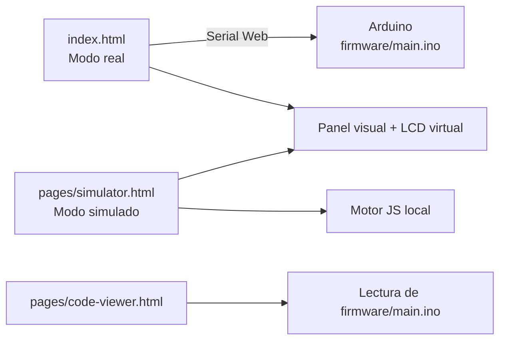

# Laboratorio de Física con Arduino

Proyecto interactivo para enseñar y experimentar conceptos de Física I con dos modos de trabajo:

- Modo real: conecta una placa Arduino por Serial Web y visualiza el estado en tiempo real.
- Modo simulado: replica la misma lógica sin hardware, ideal para pruebas, demo y despliegue web.

El proyecto está diseñado para funcionar como sitio estático (local y hosting tipo Netlify), sin dependencias externas obligatorias.

## Objetivos del proyecto

- Explicar conceptos de dinámica y cinemática con interacción visual.
- Mantener coherencia entre firmware y frontend.
- Ofrecer una experiencia usable en escritorio y móvil.
- Permitir operación offline para prácticas de laboratorio.

## Experimentos incluidos

1. Ascensor (tensión en el cable)
2. Caja con rozamiento
3. Aterrizaje lunar (MRUA + energía)
4. Catapulta (tiro parabólico)

## Estructura del repositorio

```text
proyecto-fisica-aplicada/
├─ index.html                  # Interfaz principal (modo real con Arduino)
├─ README.md
├─ assets/
│  ├─ css/
│  │  ├─ base.css
│  │  ├─ index.css
│  │  ├─ simulator.css
│  │  └─ code-viewer.css
│  ├─ js/
│  │  ├─ index.js
│  │  ├─ simulator.js
│  │  ├─ code-viewer.js
│  │  └─ particles.js
│  └─ images/
│     ├─ box.svg
│     ├─ cabin.svg
│     ├─ cabin-fail.svg
│     ├─ rocket.svg
│     ├─ runner.svg
│     └─ explosion.svg
├─ pages/
│  ├─ simulator.html           # Simulación local
│  └─ code-viewer.html         # Visor del firmware
└─ firmware/
   └─ main.ino                 # Firmware Arduino
```

## Flujo general



## Tecnologías

- HTML5
- CSS3
- JavaScript (Vanilla)
- Web Serial API (solo modo real, navegador compatible)
- Firmware Arduino (.ino)

## Requisitos

### Para modo simulado

- Cualquier navegador moderno.

### Para modo real (Arduino)

- Navegador con soporte de Web Serial API (por ejemplo, Chromium/Chrome).
- Placa Arduino cargada con `firmware/main.ino`.
- Cable USB y permisos de acceso al puerto serial.

## Ejecución local

Puedes servir el proyecto con cualquier servidor estático.

### Opción recomendada (Python)

```bash
python -m http.server 8000
```

Luego abre:

- `http://localhost:8000/index.html`
- `http://localhost:8000/pages/simulator.html`
- `http://localhost:8000/pages/code-viewer.html`

## Navegación interna

- Desde `index.html` puedes ir a simulador y visor de código.
- Desde `pages/simulator.html` puedes volver al modo real y abrir visor.
- Desde `pages/code-viewer.html` puedes volver a inicio o simulador.

## Despliegue

Compatible con hosting estático (por ejemplo Netlify), ya que:

- No requiere backend.
- No depende de build tooling.
- Usa rutas relativas en recursos y navegación.

Nota: el modo real depende del acceso local al puerto serial del navegador, por lo que en hosting público normalmente se usa para demostración visual y documentación, no para conectar hardware remoto.

## Mantenimiento recomendado

- Mantener sincronizados los cambios de lógica entre `firmware/main.ino`, `assets/js/index.js` y `assets/js/simulator.js`.
- Evitar duplicar lógica dentro de scripts inline en HTML.
- Centralizar estilos en `assets/css` y comportamiento en `assets/js`.

## Licencia

Define aquí la licencia del proyecto según tu criterio (MIT, académica interna, etc.).
